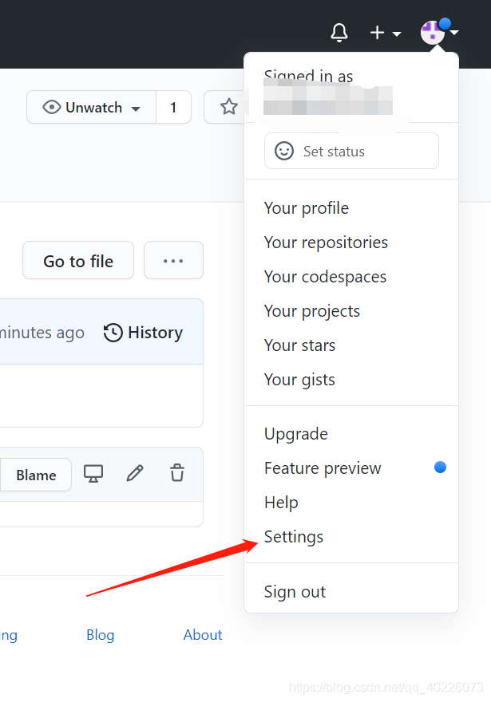
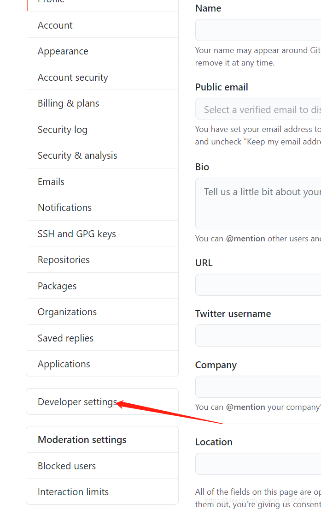
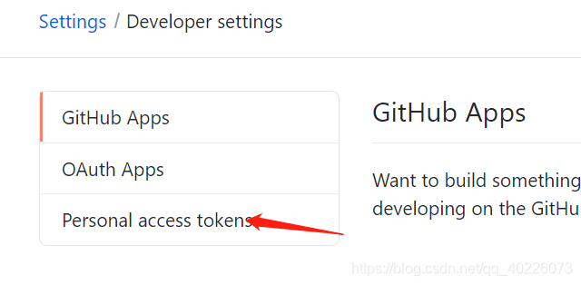
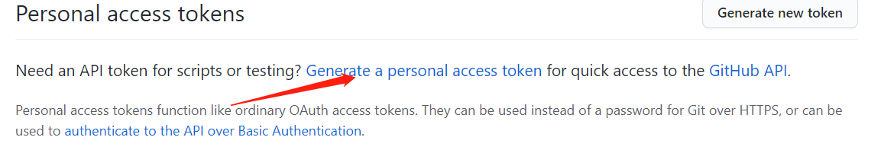
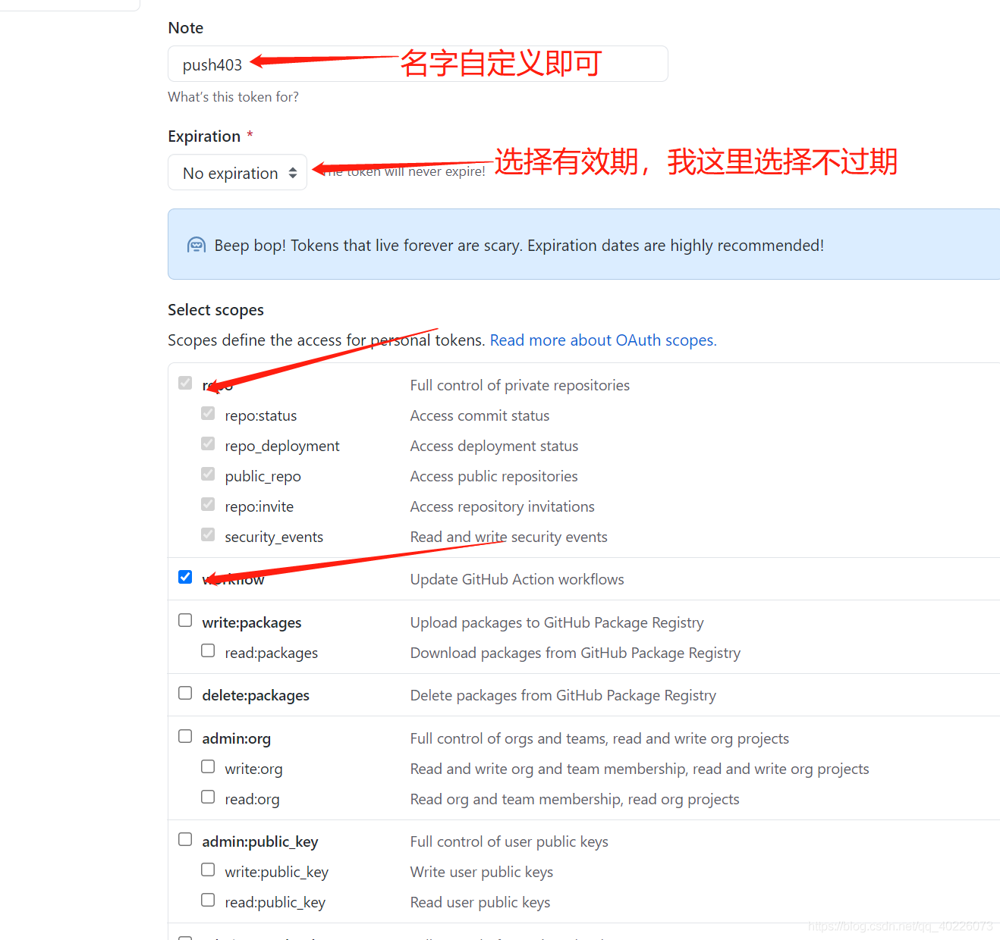
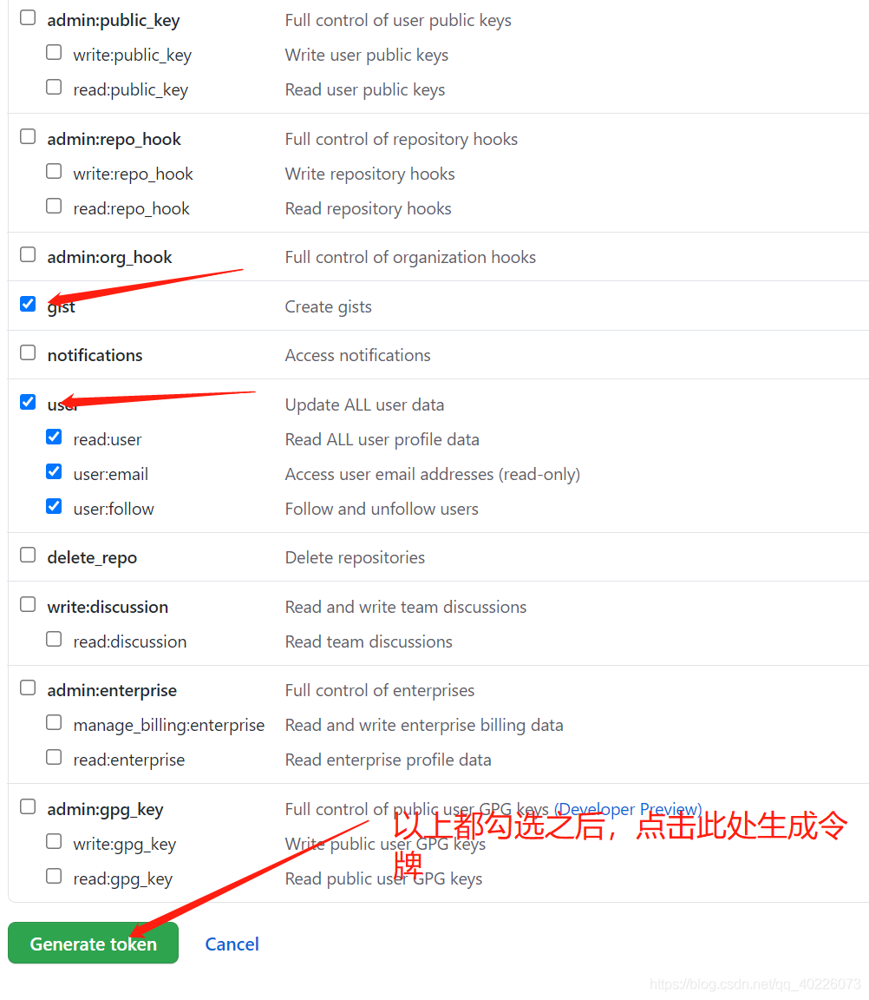
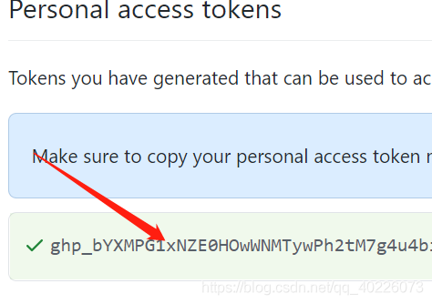

## 1. 安装Git

在terminal中输入如下命令：

`sudo apt install git`

##2. **接下来安装SSH(一定要在~/.ssh目录下操作)：**

`ssh-keygen -t rsa -C "你自己的github对应的邮箱地址"`

然会一直按回车。

最后发现，id_rsa（私钥）和id_rsa.pub（公钥）这两个文件被创建了**（通过ls查看～/.ssh下面的所有内容查看）**

**将刚刚创建的ssh keys添加到github中**

（1）利用gedit/cat命令，查看id_rsa.pub的内容

（2）在GitHub中，依次点击Settings -> SSH Keys -> Add SSH Key，将id_rsa.pub文件中的字符串复制进去，注意字符串中没有换行和空格。

再次检查SSH连接情况（在～/.ssh目录下）：

输入如下命令：`ssh -T git@github.com`

如果看到如下所示，则表示添加成功：

`Hi 你的用户名! You’ve successfully authenticated, but GitHub does not provide shell access.`

## 3. 开始使用github

###3.1 配置git

即利用自己的用户名和email地址配置git

```shell
git config --global user.name "你的github用户名"
git config --global user.email "你的github邮箱地址"
```

###3.1 如何推送本地内容到github上新建立的仓库

1. github上新建立仓库

2. 克隆github上已有的仓库`git clone https://github.com/你的github用户名/github仓库名.git`

3. 对clone下来的仓库进行更改（在仓库目录下进行）

4. 对刚刚的更改进行提交

   ```shell
   git add 更改文件名或者是文件夹名或者是点"."
   git commit -m "commit内容标注"
   ```

5. 本地仓库与github仓库关联

   ```shell
   git remote add origin https://github.com/你的github用户名/你的github仓库.git 
   ```

6. push

   ```
   git push origin master
   ```

## 4. git提交代码时的密码问题

（1）进入github官网，点击头像，弹出下拉列表，点击Settings



（2）点击Devloper settings



（3）点击Personal access token



（4）点击箭头处



（5）把我勾选的，都勾上即可，最后点击Generate token，生成令牌。





（6）得到令牌，先复制到一处，一会儿要用到，不然页面刷新就无了，得到的令牌就是git push时的密码

